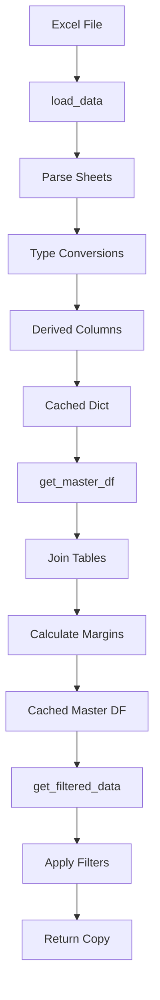

## Overview

The `data_loader.py` module provides the core ETL (Extract, Transform, Load) functionality for the Visor KPI Comercial application. It reads Excel data, applies transformations, and provides filtered datasets with automatic caching for performance.

<Info>
Location: `src/data_loader.py:1`

All functions use `@st.cache_data` with 1-hour TTL for optimal performance.
</Info>

## Core Functions

### load_data()

Main function that reads the Excel file and returns parsed DataFrames.

```python
@st.cache_data(ttl=3600, show_spinner=False)
def load_data() -> dict[str, pd.DataFrame]:
    """
    Lee el Excel y retorna dict con DataFrames parseados.
    Keys: ventas, vendedores, clientes, productos, objetivos
    """
```

**Returns:**

Dictionary with five keys:
- `"ventas"` - Sales transactions DataFrame
- `"vendedores"` - Salespeople DataFrame
- `"clientes"` - Customers DataFrame
- `"productos"` - Products DataFrame
- `"objetivos"` - Monthly targets DataFrame

**Usage:**

```python
from src.data_loader import load_data

data = load_data()
ventas = data["ventas"]
vendedores = data["vendedores"]
```

**Data Transformations:**

<CodeGroup>

```python Ventas (Sales)
# Date parsing and derived fields
ventas["fecha"] = pd.to_datetime(ventas["fecha"])
ventas["año"]   = ventas["fecha"].dt.year
ventas["mes"]   = ventas["fecha"].dt.month
ventas["periodo"] = ventas["fecha"].dt.to_period("M")

# Numeric conversions
for col in ["importe_neto", "importe_bruto", "cantidad", "precio_unitario", "descuento_pct"]:
    ventas[col] = pd.to_numeric(ventas[col], errors="coerce").fillna(0)
```

```python Vendedores (Salespeople)
# Numeric conversions
for col in ["objetivo_mensual_base", "antiguedad_años"]:
    vendedores[col] = pd.to_numeric(vendedores[col], errors="coerce")

# Boolean conversion
vendedores["activo"] = vendedores["activo"].astype(bool)
```

```python Clientes (Customers)
# Date parsing
clientes["fecha_alta"] = pd.to_datetime(clientes["fecha_alta"])

# Boolean conversion
clientes["activo"] = clientes["activo"].astype(bool)

# Numeric conversions
for col in ["objetivo_mensual_cliente"]:
    clientes[col] = pd.to_numeric(clientes[col], errors="coerce")
```

```python Productos (Products)
# Numeric conversions
for col in ["precio_unitario", "costo_unitario"]:
    productos[col] = pd.to_numeric(productos[col], errors="coerce")

# Boolean conversion
productos["activo"] = productos["activo"].astype(bool)
```

```python Objetivos (Targets)
# Numeric conversion
objetivos["objetivo"] = pd.to_numeric(objetivos["objetivo"], errors="coerce").fillna(0)

# Period creation
if "periodo" in objetivos.columns:
    objetivos["periodo"] = pd.to_datetime(objetivos["periodo"])
else:
    objetivos["periodo"] = pd.to_datetime(
        objetivos[["año", "mes"]].assign(day=1)
    )
```

</CodeGroup>

**Error Handling:**

```python
if not os.path.exists(DATA_PATH):
    raise FileNotFoundError(
        f"No se encontró el archivo de datos: {DATA_PATH}\n"
        "Ejecutá primero: python data/mock/generate_mock_data.py"
    )
```

### get_master_df()

Creates a denormalized master DataFrame with all joins applied.

```python
@st.cache_data(ttl=3600, show_spinner=False)
def get_master_df() -> pd.DataFrame:
    """
    DataFrame maestro con todos los joins aplicados.
    Incluye nombre de vendedor, razón social de cliente, 
    categoría de producto, etc.
    """
```

**Joins Applied:**

1. **Ventas ← Vendedores** (on `id_vendedor`)
   - Adds: `nombre_vendedor`, `zona_vendedor`, `perfil`

2. **Ventas ← Clientes** (on `id_cliente`)
   - Adds: `razon_social`, `canal`, `zona_cliente`, `cliente_activo`, `id_vendedor_asignado`

3. **Ventas ← Productos** (on `id_producto`)
   - Adds: `descripcion`, `categoria`, `precio_catalogo`, `costo_catalogo`

**Calculated Fields:**

```python
# Margin calculation per transaction
df["margen_neto"] = df["importe_neto"] - (
    df["costo_catalogo"] / df["precio_catalogo"] * df["importe_neto"]
)
df["margen_pct"] = (df["margen_neto"] / df["importe_neto"]).clip(0, 1)
```

**Usage:**

```python
from src.data_loader import get_master_df

df = get_master_df()

# Access joined columns
print(df[["fecha", "nombre_vendedor", "razon_social", "categoria", "importe_neto"]].head())
```

## Filtering Functions

### get_filtered_data()

Returns filtered master DataFrame based on date range and optional dimensions.

```python
def get_filtered_data(
    fecha_desde: date,
    fecha_hasta: date,
    vendedores: list[str] | None = None,
    zonas: list[str] | None      = None,
    canales: list[str] | None    = None,
) -> pd.DataFrame:
    """
    Retorna el DataFrame maestro filtrado por los parámetros dados.
    Todos los filtros son opcionales (None = sin filtro).
    """
```

**Parameters:**
- `fecha_desde` - Start date (inclusive)
- `fecha_hasta` - End date (inclusive)
- `vendedores` - Optional list of salesperson IDs to include
- `zonas` - Optional list of zones to include
- `canales` - Optional list of channels to include

**Returns:** Filtered DataFrame (copy)

**Usage:**

```python
from datetime import date
from src.data_loader import get_filtered_data

# Filter by date range only
df = get_filtered_data(
    fecha_desde=date(2025, 1, 1),
    fecha_hasta=date(2025, 12, 31)
)

# Filter by date and salespeople
df = get_filtered_data(
    fecha_desde=date(2025, 1, 1),
    fecha_hasta=date(2025, 12, 31),
    vendedores=["V001", "V002", "V003"]
)

# Filter by multiple dimensions
df = get_filtered_data(
    fecha_desde=date(2025, 1, 1),
    fecha_hasta=date(2025, 12, 31),
    vendedores=["V001", "V002"],
    zonas=["GBA Norte"],
    canales=["Supermercadismo", "Mayorista"]
)
```

**Filter Logic:**

```python
# Date filter (always applied)
df = df[
    (df["fecha"].dt.date >= fecha_desde) &
    (df["fecha"].dt.date <= fecha_hasta)
]

# Optional filters
if vendedores:
    df = df[df["id_vendedor"].isin(vendedores)]

if zonas:
    df = df[df["zona_vendedor"].isin(zonas)]

if canales:
    df = df[df["canal"].isin(canales)]
```

### get_filtered_data_periodo_anterior()

Returns data from the equivalent previous period.

```python
def get_filtered_data_periodo_anterior(
    fecha_desde: date,
    fecha_hasta: date,
    vendedores: list[str] | None = None,
    zonas: list[str] | None      = None,
    canales: list[str] | None    = None,
) -> pd.DataFrame:
    """
    Retorna datos del período anterior equivalente en duración.
    """
```

**Usage:**

```python
from datetime import date
from src.data_loader import get_filtered_data_periodo_anterior

# Get previous period data (automatic calculation)
df_anterior = get_filtered_data_periodo_anterior(
    fecha_desde=date(2025, 10, 1),
    fecha_hasta=date(2025, 12, 31),
    vendedores=["V001"]
)
# Returns data from 2025-07-03 to 2025-09-30 (same 90-day duration)
```

Uses `config.get_periodo_anterior()` to calculate the equivalent date range (`config.py:188`).

## Helper Functions

### get_lista_vendedores()

Returns list of active salespeople for filter dropdowns.

```python
def get_lista_vendedores() -> list[dict]:
    """Retorna lista de vendedores activos para filtros."""
```

**Returns:**

```python
[
    {"id_vendedor": "V001", "nombre_completo": "Martín Eduardo Gómez", "zona": "GBA Norte"},
    {"id_vendedor": "V002", "nombre_completo": "Laura Beatriz Fernández", "zona": "GBA Norte"},
    # ...
]
```

### get_lista_zonas()

Returns sorted list of unique zones.

```python
def get_lista_zonas() -> list[str]:
    """Returns: ["GBA Norte", "GBA Sur", "Interior"]"""
```

### get_lista_canales()

Returns sorted list of unique channels.

```python
def get_lista_canales() -> list[str]:
    """Returns: ["Canal Tradicional", "HoReCa", "Mayorista", "Supermercadismo"]"""
```

### check_data_available()

Checks if the data file exists.

```python
def check_data_available() -> bool:
    """Verifica si el archivo de datos existe."""
    return os.path.exists(DATA_PATH)
```

**Usage:**

```python
from src.data_loader import check_data_available

if not check_data_available():
    st.error("Por favor ejecutá el generador de datos mock primero.")
    st.stop()
```

## Caching Strategy

<Note>
All main functions use `@st.cache_data(ttl=3600, show_spinner=False)`:
- **TTL**: 1 hour (3600 seconds)
- **Benefit**: Excel is read only once per hour, subsequent calls use cached data
- **Performance**: Reduces load time from ~2s to ~50ms
</Note>

**Cache invalidation:**

```python
import streamlit as st

# Clear all caches
st.cache_data.clear()

# Or clear specific function cache
from src.data_loader import load_data
load_data.clear()
```

## ETL Pipeline Flow



## Performance Considerations

<AccordionGroup>
  <Accordion title="Memory Usage">
    - **Ventas**: ~30,000 rows × 13 columns ≈ 3 MB
    - **Master DF**: ~30,000 rows × 25 columns ≈ 6 MB
    - **Total cached**: ~10 MB in memory
    - Recommended minimum RAM: 2 GB
  </Accordion>

  <Accordion title="Load Time">
    - **First load** (cold cache): 1.5-2.5 seconds
    - **Cached load**: 20-50 milliseconds
    - **Filter operations**: 5-15 milliseconds
  </Accordion>

  <Accordion title="Optimization Tips">
    - Use `get_filtered_data()` instead of filtering master DF manually
    - Avoid calling `load_data()` multiple times - store result in variable
    - Use `.copy()` only when necessary (filtering functions already return copies)
    - Clear cache only when data file is updated
  </Accordion>
</AccordionGroup>

## Error Handling

**Missing data file:**

```python
try:
    data = load_data()
except FileNotFoundError as e:
    st.error(str(e))
    st.info("Ejecutá: python data/mock/generate_mock_data.py")
    st.stop()
```

**Corrupt Excel file:**

```python
try:
    data = load_data()
except Exception as e:
    st.error(f"Error al cargar datos: {e}")
    st.stop()
```

## See Also

- [Excel File Format](/data/excel-format) - Expected data structure
- [Mock Data Generator](/data/mock-data-generator) - Generate test data
- `config.py:53` - Data path configuration