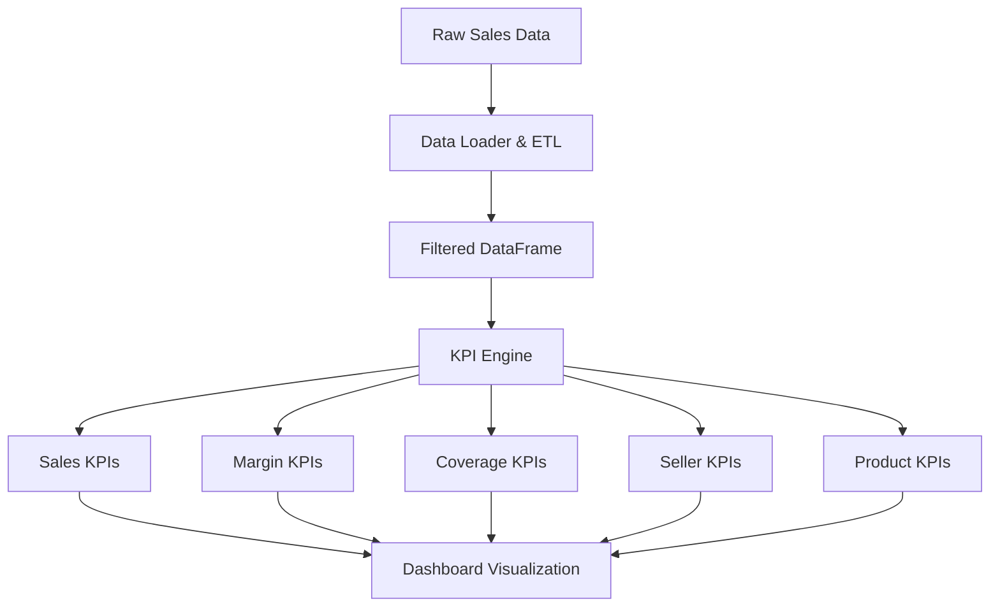

## What is the KPI Engine?

The KPI Engine (`kpi_engine.py`) is the core calculation module that transforms filtered sales DataFrames into actionable business intelligence. It processes transaction data and computes comprehensive metrics for sales performance, margins, customer coverage, and product analysis.

<Info>
  All functions in the KPI Engine receive **pre-filtered DataFrames** and return structured dictionaries or DataFrames ready for visualization.
</Info>

## Key Design Principles

<CardGroup cols={2}>
  <Card title="Pre-filtered Input" icon="filter">
    Functions expect DataFrames already filtered by date range, seller, zone, or other criteria
  </Card>
  <Card title="Clean Output" icon="chart-line">
    Returns structured data ready for dashboard consumption without additional processing
  </Card>
  <Card title="Period Comparisons" icon="code-compare">
    Most functions accept `df_anterior` for period-over-period analysis
  </Card>
  <Card title="Objective Tracking" icon="bullseye">
    Integrates with objectives DataFrames for quota compliance calculation
  </Card>
</CardGroup>

## Core KPI Categories

The engine is organized into five main functional groups:

### 1. Sales Metrics

Aggregate KPIs for period performance including total sales, quota compliance, transaction count, and average ticket.

```python
from src.kpi_engine import kpi_ventas_periodo
```

[Learn more about Sales Metrics →](/kpi-engine/sales-metrics)

### 2. Margin Analysis

Gross margin calculations and profitability tracking across periods.

```python
from src.kpi_engine import kpi_margen
```

[Learn more about Margin Analysis →](/kpi-engine/margin-analysis)

### 3. Customer Coverage

Customer portfolio health metrics including coverage percentage, churn, and new customer acquisition.

```python
from src.kpi_engine import kpi_cobertura_clientes
```

[Learn more about Customer Coverage →](/kpi-engine/customer-coverage)

### 4. Pareto Analysis

Automatic 80/20 classification for customers and products with concentration metrics.

```python
from src.pareto import calcular_pareto, get_concentracion_pareto
```

[Learn more about Pareto Analysis →](/kpi-engine/pareto-analysis)

### 5. Seller & Product KPIs

Detailed breakdowns by salesperson and product including rankings, Pareto classification, and trend analysis.

```python
from src.kpi_engine import kpi_por_vendedor, kpi_productos, kpi_clientes
```

## Architecture Overview



## Data Flow

1. **Input**: Pre-filtered pandas DataFrames from `data_loader.py`
2. **Processing**: KPI calculation functions apply business logic
3. **Output**: Structured dictionaries or DataFrames with calculated metrics
4. **Visualization**: Components consume output for charts and tables

## Common Parameters

Most KPI functions share these common parameters:

<ParamField path="df" type="pd.DataFrame" required>
  Main DataFrame with sales transactions for the current period
</ParamField>

<ParamField path="df_anterior" type="pd.DataFrame | None" default="None">
  DataFrame with sales from the previous period for comparison calculations
</ParamField>

<ParamField path="objetivos_df" type="pd.DataFrame | None" default="None">
  DataFrame with sales objectives/quotas by seller and period
</ParamField>

<ParamField path="fecha_desde" type="date | None" default="None">
  Start date for the analysis period
</ParamField>

<ParamField path="fecha_hasta" type="date | None" default="None">
  End date for the analysis period
</ParamField>

## Quick Start Example

```python
import pandas as pd
from datetime import date
from src.kpi_engine import kpi_ventas_periodo
from src.data_loader import cargar_datos

# Load and filter data
df_ventas, df_clientes, df_objetivos = cargar_datos('data/raw/mock_data.xlsx')
fecha_desde = date(2026, 3, 1)
fecha_hasta = date(2026, 3, 31)

# Filter current period
df_marzo = df_ventas[
    (df_ventas['fecha'] >= pd.Timestamp(fecha_desde)) &
    (df_ventas['fecha'] <= pd.Timestamp(fecha_hasta))
]

# Filter previous period
df_febrero = df_ventas[
    (df_ventas['fecha'] >= pd.Timestamp(date(2026, 2, 1))) &
    (df_ventas['fecha'] <= pd.Timestamp(date(2026, 2, 28)))
]

# Calculate KPIs
kpis = kpi_ventas_periodo(
    df=df_marzo,
    df_anterior=df_febrero,
    objetivos_df=df_objetivos,
    fecha_desde=fecha_desde,
    fecha_hasta=fecha_hasta
)

print(f"Total sales: ${kpis['importe_total']:,.2f}")
print(f"Quota compliance: {kpis['cumplimiento_pct']:.1%}")
print(f"vs. previous period: {kpis['importe_vs_anterior']:+.1%}")
```

## Next Steps

<CardGroup cols={2}>
  <Card title="Sales Metrics" icon="dollar-sign" href="/kpi-engine/sales-metrics">
    Learn how to calculate sales KPIs and track quota compliance
  </Card>
  <Card title="Margin Analysis" icon="percent" href="/kpi-engine/margin-analysis">
    Understand profitability tracking and margin calculations
  </Card>
  <Card title="Customer Coverage" icon="users" href="/kpi-engine/customer-coverage">
    Monitor customer portfolio health and coverage metrics
  </Card>
  <Card title="Pareto Analysis" icon="chart-pie" href="/kpi-engine/pareto-analysis">
    Implement 80/20 analysis for customers and products
  </Card>
</CardGroup>